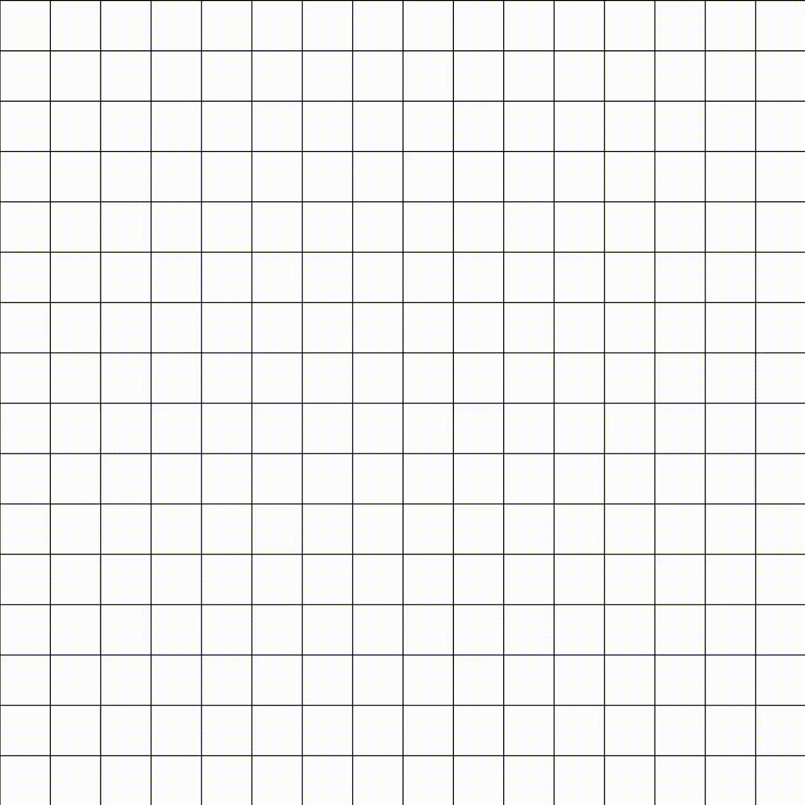

# Mine sweeper
This is a simple game mine sweeper created in the processing programming language!

<h2> How to play </h2>

    To win at mine sweeper, you have to avoid clicking on a bomb. Bombs are represented by grey spheres. When you left click on one of the tiles, either you will find one or more numbers or you will be bombed. The numbers represent the number of bombs around that individual tile, wheter horizontally, vertically or diagonally. To spot a bomb, just click with your right mouse button to place a red sphere.   You can tweak with the number of bombs by changing the BOMBS_RATIO variable.

 

